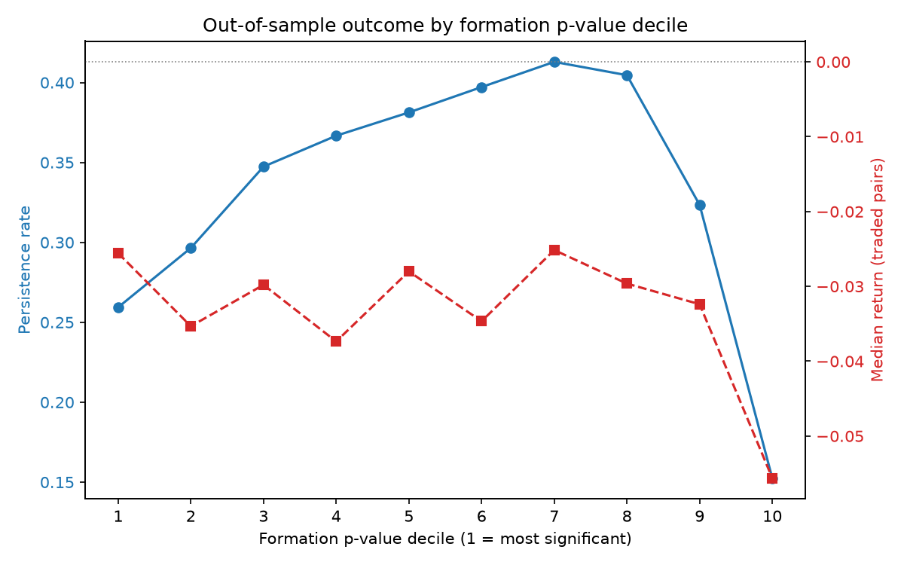

# Does the cointegration p-value pick pairs that revert?

Pairs are usually selected with an Engle-Granger test, with a smaller p-value
taken to mean a better pair. This study tests that out of sample.

## Data

- 54 S&P 500 stocks: top 8 by market cap in each of the 7 largest GICS sectors
  (GOOG excluded as a second share class of GOOGL, GEV for short history)
- 13 rolling windows: 3 year formation, 1 year test (test years 2013-2025)
- Both directions of each pair are screened (2,862 ordered pairs per window).
  The outcome analysis keeps one direction per pair: 18,289 pair-years
- Alpha, beta, spread mean and spread std are fitted on formation and held
  fixed in the test year

## Outcome

Each pair-year is evaluated two ways.

### Persistence

A pair-year **persisted** if the z-score crossed zero at least twice during the
test year and never reached |z| = 4. Both conditions are needed: a spread that
never crosses has stopped oscillating, and one that reaches 4 sd has broken the
formation relationship.

### Trading

The spread is traded on the frozen z-score:

- **enter** when |z| reaches 2
- **exit** when z crosses its mean, closing the trade as **reverted**
- **stop** when |z| reaches 4, closing it as **stopped**
- positions still open at year end are **marked** to market and closed

After a trade closes, the strategy cannot re-enter until |z| falls back inside
2. Without that gate a spread sitting outside the band would be re-entered on
every bar. Pair-years therefore carry between zero and a few trades; mean
trades per pair-year runs from 1.04 to 1.77 across deciles.

A trade's return is the z-score captured, converted to price terms by the
frozen formation std, over the capital committed at entry:

```
z_captured    = sign(entry_z) * (entry_z - exit_z)
entry_capital = |y_entry| + |beta| * |x_entry|
trade_return  = z_captured * spread_std / entry_capital - 0.001 - 0.0005
```

Returns are therefore **net** of a 10bp round trip cost and 5bp slippage. A
pair-year's return is the sum of its trade returns. Stop fills are capped at
the stop level, which flatters the strategy: a real gap through the stop fills
worse.

Across 18,289 pair-years there are 23,447 trades: 6,310 reverted, 10,742
stopped, 6,395 marked. The headline measure is **stop-outs per reversion**,
overall **1.70**. It is a ratio rather than a share because a spread that moves
further in z units hits both barriers more often, so the stopped and reverted
shares both rise with volatility. The ratio asks which way a trade resolved,
not how often one happened.

Return statistics use traded pairs only: a pair that never opened has a return
of exactly zero, which is not the same as a flat trade.

## Results

### 1. The screen's pass rate is within noise

A block bootstrap resamples returns with the same blocks for every stock, which
removes cointegration but keeps cross-sectional correlation and volatility
clustering. On the 2015-17 formation window (20 replications each):

| Block length | Mean pass rate | sd | 5th-95th percentile |
|---|---|---|---|
| 10 days | 7.15% | 3.54pp | 2.9%-13.9% |
| 21 days | 6.16% | 4.01pp | 1.9%-12.0% |

Observed pass rates at p < 0.05 range from 3.54% to 13.07%. All are inside the
block 10 range.

### 2. The p-value does not rank pairs below decile 10

Deciles are formed within each test year.



| Decile | Mean p | Pairs | Persistence | Median return | Losing | Stop/revert |
|---|---|---|---|---|---|---|
| 1 | 0.043 | 1,839 | 25.9% | -2.56% | 56.7% | 1.56 |
| 2 | 0.137 | 1,828 | 29.7% | -3.53% | 60.7% | 1.65 |
| 3 | 0.236 | 1,828 | 34.7% | -2.98% | 56.6% | 1.52 |
| 4 | 0.331 | 1,827 | 36.7% | -3.74% | 58.8% | 1.69 |
| 5 | 0.435 | 1,828 | 38.1% | -2.80% | 56.6% | 1.53 |
| 6 | 0.536 | 1,828 | 39.7% | -3.47% | 58.4% | 1.63 |
| 7 | 0.645 | 1,826 | 41.3% | -2.51% | 56.2% | 1.59 |
| 8 | 0.756 | 1,829 | 40.5% | -2.96% | 58.7% | 1.59 |
| 9 | 0.866 | 1,827 | 32.4% | -3.24% | 57.8% | 1.88 |
| 10 | 0.962 | 1,829 | 15.3% | -5.56% | 65.6% | 3.41 |

The stop/revert ratio sits between 1.52 and 1.69 across deciles 1 to 8 with no
ordering. Only decile 10 separates.

Persistence is not monotonic in the p-value either. It rises from 25.9% in
decile 1 to 41.3% in decile 7, then falls to 15.3% in decile 10. Both
conditions in the persistence test can fail at opposite ends: a tight formation
fit gives a small spread std, so ordinary moves are large in z units and reach
the 4 sd bound, while a loose fit gives a large spread std, so the z-score
barely moves and does not cross.

Comparing the extremes directly:

| | Decile 1 | Decile 10 |
|---|---|---|
| Median return | -2.56% | -5.56% |
| Mean return | -0.94% | -3.36% |
| Fraction losing | 56.7% | 65.6% |
| Persistence rate | 25.9% | 15.3% |

### 3. Sector and sub-industry

| | Pairs | Persistence | Median return | Losing | Stop/revert |
|---|---|---|---|---|---|
| Same sector | 2,326 | 33.5% | -2.77% | 57.5% | 1.71 |
| Cross sector | 15,963 | 33.4% | -3.44% | 58.8% | 1.70 |
| Same sub-industry | 411 | 32.6% | -3.38% | 58.6% | 1.72 |
| Different sub-industry | 17,878 | 33.4% | -3.34% | 58.7% | 1.70 |

None of the four measures separates on sector or on sub-industry.

### 4. Outcomes track the volatility regime


| Against mean VIX (n = 13 years) | Pearson r | p | Spearman rho | p |
|---|---|---|---|---|
| Stop-outs per reversion | -0.478 | 0.098 | **-0.648** | **0.017** |
| Fraction losing | -0.516 | 0.071 | **-0.709** | **0.007** |
| Median return | +0.479 | 0.098 | **+0.604** | **0.029** |
| Persistence rate | +0.199 | 0.514 | +0.374 | 0.209 |

Pairs trading fares worse in calm markets. The three worst years, 2013, 2017
and 2024, had mean VIX of 14.2, 11.1 and 15.6 and stop/revert ratios of 3.86,
2.72 and 3.02. The best, 2022 and 2023, ran at 25.6 and 16.9. Year by year
figures are in `notes.md`.

## Validation

`test_coint.py` checks the engine against synthetic data with known answers,
generated by `synthetic.py`. On cointegrated pairs with a true hedge ratio of
2.0 and a half life of 10, across 49 seeds, it recovers a mean beta 0.4% from
the true value at a per-seed standard deviation of 2.0%, recovers the half
life, and detects every true pair. On 1,000 independent random walks the false
positive rate is 5.5% and the p-values are approximately uniform.

Tolerances come from the measured spread rather than from guessing. Nothing
downstream is trusted until these pass.

`simulate.py` run directly checks the trade simulator on four hand-worked
z-paths: a reversion, a position still open at the end, two trades in one
window, and a stop out.

## Running it

```bash
pip install -r requirements.txt

python universe.py      # stock universe
python prices.py        # adjusted closes
python test_coint.py    # engine validation, ~20 min
python screen.py        # screen, ~30 min
python bootstrap.py     # null distribution, ~1 hr
python labels.py        # persistence and trades per pair-year
python analysis.py      # tables and figures
```

## Limitations

- Survivorship bias: current index members and caps are used back to 2010
- The VIX result rests on 13 years
- No standard errors on the decile table, since pair-years share stocks and
  years
- The null is estimated on one window with 20 replications
- Stop fills are capped at the stop level, so losses are understated
- Costs are a flat 10bp round trip plus 5bp slippage, the same for every pair
  regardless of liquidity
- Barrier levels (2, 0 and 4) and formation length (3 years) are not varied
- Prices end on 30 December 2025
