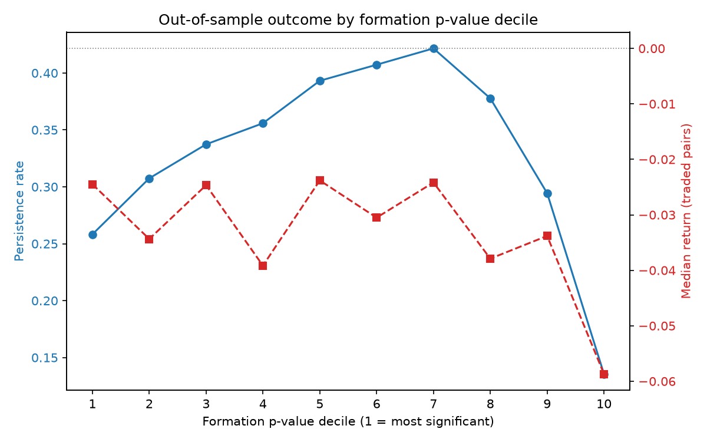
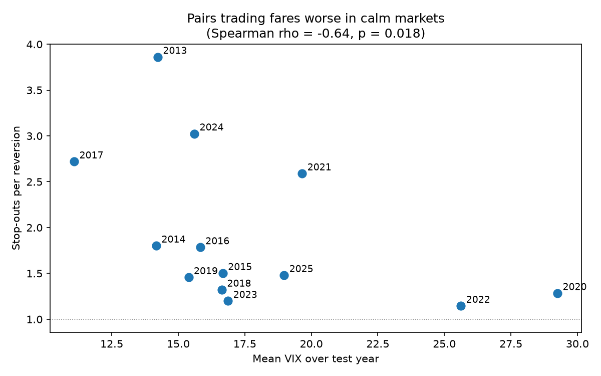

# Does a cointegration p-value predict which pairs actually trade well?

Pairs trading rests on finding two stocks whose spread reverts. The standard way
to find them is an Engle-Granger cointegration test, and the p-value it returns
is treated as a ranking: the smaller it is, the better the pair.

This study tests that. It screens 2,862 ordered pairs of S&P 500 stocks across
13 rolling windows, trades each one the following year on frozen parameters, and
checks whether the ranking held up.

It did not. Formation p-value carries no useful information about out-of-sample
performance. Outcomes track volatility regime instead.

## Findings

**1. The p-value ranking is not monotone. Middle-ranked pairs do best.**



| Decile | Mean p | Persistence | Median return | Stop-outs per reversion |
|---|---|---|---|---|
| 1 (most significant) | 0.043 | 25.8% | -0.0245 | 1.52 |
| 5 | 0.447 | 39.3% | -0.0238 | 1.42 |
| 7 | 0.659 | 42.2% | -0.0242 | 1.51 |
| 10 (least significant) | 0.968 | 13.6% | -0.0587 | 3.88 |

Pairs at p ≈ 0.66, which no practitioner would trade, held together 42% of the
time against 26% for the most significant decile. Every decile lost money on
median.

The only place the p-value carries information is at the bottom. Decile 10
stopped out 3.9 times per reversion against about 1.5 everywhere else, so the
test reliably identifies pairs with no relationship at all.

**2. The screen finds no more pairs than dependence-preserving noise.**

A block bootstrap null puts the false positive rate at 6.4%, not the nominal 5%.
Against that benchmark, windows testing 2013-19 averaged 4.82%, so real S&P 500
pairs cointegrated *less* often than resampled data with cointegration destroyed
by construction.

**3. Outcomes track volatility regime.**



Stop-outs per reversion correlate negatively with mean VIX across the 13 test
years (Spearman ρ = −0.643, p = 0.018), as does the fraction of pairs losing
money (ρ = −0.599, p = 0.031). The worst years were the calmest: 2017 had the
lowest VIX in the sample at 11.1 and produced 3.3 stop-outs per reversion, while
2020 at VIX 29.3 produced 1.21.

Formation persistence shows no such relationship (ρ = 0.225, p = 0.459).

**4. Economic linkage makes no difference.**

| | Persistence | Median return | Stop-outs per reversion |
|---|---|---|---|
| Cross sector | 32.83% | -0.0342 | 1.71 |
| Same sector | 33.19% | -0.0276 | 1.68 |
| Same sub-industry (n=822) | 32.97% | -0.0277 | 1.68 |

Two semiconductor firms behave like a bank paired with a soft drinks company.

## Method

**Universe.** The 7 largest GICS sectors by aggregate S&P 500 market cap, top 8
constituents by cap in each. GOOG is excluded as a second share class of GOOGL,
where near-identical series make the EG test numerically unreliable. GEV is
excluded for having 441 trading days against a 650 day minimum. 54 stocks.

**Screen.** 3 year formation window, 1 year test window, stepped annually from
2010. Both directions of each pair are tested, since Engle-Granger is asymmetric
and y-on-x is a different test from x-on-y.

**Validation.** The engine is checked against synthetic data with known answers
before any of it is trusted. Across 49 seeds it recovers a hedge ratio of 2.0 to
within 0.4% and detects every true pair. On 1,000 independent random walks it
produces a 5.5% false positive rate against a nominal 5%, with p-values
approximately uniform (mean 0.5066, sd 0.2900 against 0.5 and 0.2887 expected).

**Bootstrap null.** Returns are resampled in blocks and cumulated back to
prices. The same block sequence is applied to every stock, so contemporaneous
correlation survives while the long-run relationship does not. Mean pairwise
return correlation is 0.3587 in the real data and 0.3626 resampled.

**Trading.** Enter at |z| ≥ 2 on the frozen spread, exit on reversion past the
mean or a 4σ stop, 10bp round-trip cost plus slippage. Positions still open at
the window end are marked to market rather than discarded.

## Running it

```bash
pip install -r requirements.txt

python universe.py      # builds data/universe.csv
python prices.py        # builds data/prices.parquet
python test_coint.py    # validates the engine, ~20 min
python screen.py        # runs the screen, ~30 min
python labels.py        # evaluates each pair on its test year
python bootstrap.py     # builds the null distribution, ~1 hr
python analysis.py      # tables and figures
```

Each script caches its output, so re-running skips work already done.

| File | Does |
|---|---|
| `universe.py` | Builds the stock universe |
| `prices.py` | Downloads and caches adjusted closes |
| `coint.py` | Engle-Granger test for one ordered pair |
| `synthetic.py` | Generates data with known answers |
| `test_coint.py` | Validates the engine against it |
| `screen.py` | Runs the screen across every pair and window |
| `simulate.py` | Trades one pair's spread |
| `labels.py` | Persistence label and trading outcome per pair |
| `bootstrap.py` | Block bootstrap null |
| `analysis.py` | Tables and figures |

`notes.md` has the full working notes, including things that did not make it
into this summary.

## Limitations

- **Survivorship bias.** The universe uses current index membership and current
  market caps, then runs back to 2010. Fixing this needs point-in-time
  constituent data. It biases toward survivors, so toward optimism.
- **n = 13 on the volatility result.** A correlation needs to be around 0.55 to
  reach p < 0.05 at this sample size. The scatter also looks more like two
  clusters than a gradient, with ten years at 1.1-1.6 stop-outs per reversion
  and four at 2.7-3.8.
- **One formation window length.** Only 3 years was tested.
- **The persistence label may be confounded.** It requires ≥2 zero crossings and
  max|z| < 4, which could be measuring moderate spread volatility rather than
  mean reversion. This would explain the inverted U and has not been tested.
- **Bootstrap replications are few.** 20 per block length, and the sd at block 21
  is 4.81pp.

## Built with

Python, pandas, NumPy, statsmodels, arch, SciPy, matplotlib, yfinance.